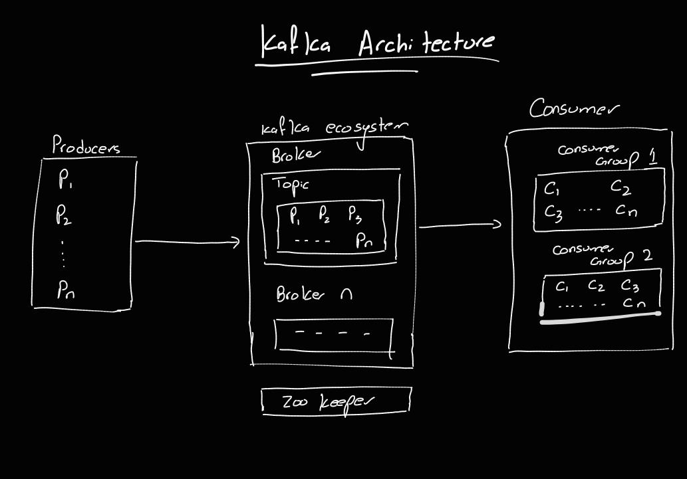

1) install docker 
2) run `docker-compose up -d`
3) run following command to create a topic 
  `docker exec -it <kafka_container_id> kafka-topics --create --topic my-topic --bootstrap-server localhost:9092 --partitions 1 --replication-factor 1`

4) run following command to list topics `docker exec -it <kafka_container_id> kafka-topics --list --bootstrap-server localhost:9092`
5) run below command to listen all event in terminal `docker exec -it <kafka_container_id> kafka-console-consumer --bootstrap-server localhost:9092 --topic my-topic --from-beginning`
6) run following command to kill container `docker-compose down`

#kafka Flow of Event

## Producer
The producer is an application that triggers events and sends an event to the kafka topic.
## Topic 
A topic is a category or feed name to which records are sent by producers. Kafka topics are multi-subscriber, meaning that a topic can have zero or more consumer groups reading from it. Each topic is split into partitions. Partitions are the fundamental unit of parallelism in Kafka. Each record in a topic is assigned to one partition based on the record's key or round-robin fashion if no key is provided.

Partition are divided into mutiple brokers where one acts as leader and other as followers which helps kafka to be fault tolerant.

## Consumer Group
A consumer group is a group of consumers(same services) that work together to consume messages from a topic. Each consumer in the group reads messages from one or more partitions exclusively.

When a consumer group reads messages:

Each consumer in the group is assigned one or more partitions. Kafka ensures that each partition is read by only one consumer within the group.
The consumer reads messages starting from the last committed offset and processes them.
After processing, the consumer commits the new offset to Kafka, marking the message as consumed.

## Scenarios Involving Consumer Groups and Partitions

### Two or More Consumer Groups:

Each consumer group reads the messages independently. Messages are delivered to each consumer group separately, meaning that every consumer group will receive a copy of each message in the topic.

### Number of Partitions Less Than Total Consumers in a Group:

If the number of partitions in a topic is less than the total number of consumers in a consumer group, some consumers will be idle.
For example, if a topic has 2 partitions and a consumer group has 3 consumers, one of the consumers will not receive any messages because there are not enough partitions to assign.